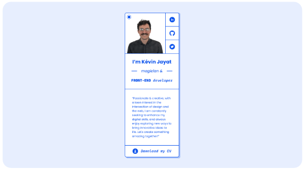

## Preview

 

# My Virtual Card

My Virtual Card is a web application that allows users to create and share their virtual business cards.

## Installation

1. Clone the repository.
2. Install dependencies using Yarn: `yarn install`
3. Start the development server: `yarn dev`

## Usage

- To start the development server, run: `yarn dev`

## Technologies Used

- [Vite](https://vitejs.dev/) - Build tool and development server
- [React](https://reactjs.org/) - JavaScript library for building user interfaces

## Contributing

If you would like to contribute to this project, please follow these steps:

1. Fork the repository.
2. Create a new branch: `git checkout -b feature/my-feature`.
3. Make your changes and commit them: `git commit -am 'Add some feature'`
4. Push to the feature branch: `git push origin feature/my-feature`.
5. Create a new Pull Request.
